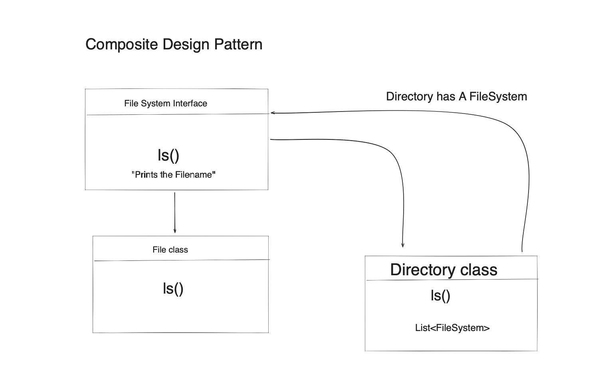

# Composite Design Pattern

We are designing a low level design pattern for a file system 

We create a File System interface and the two concrete class 
which implement this interface. 

It is like a tree data structure where each element has child elements.

##### Example :
File System has a File or Directory
A Directory can have a File or another Directory
The File class is the leaf class, and It can no more have child elements.

The below image shows how the classes should be arranged.

---
### UML Diagram
